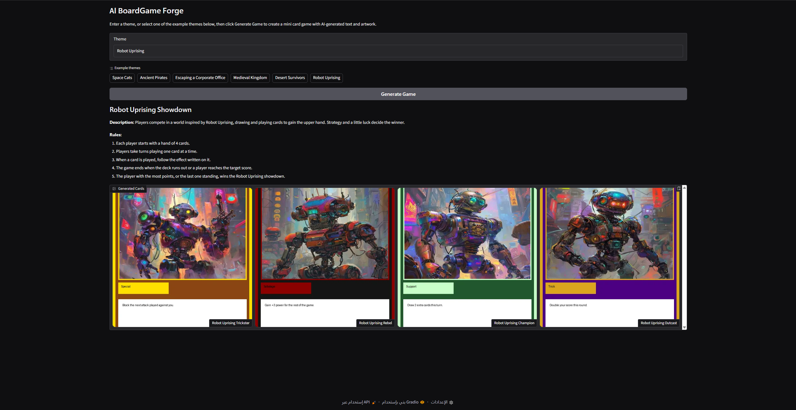

# AI BoardGame Forge

## Preview



## Live Demo

Try the application here:

[Launch AI BoardGame Forge](https://huggingface.co/spaces/GhalaDev/AI_BoardGames_Forge)


AI BoardGame Forge is a simple AI-powered web application that creates complete mini card games from any theme entered by the user.

The application automatically generates:

- A game title
- A game description
- Simple game rules
- Four unique game cards
- AI-generated artwork for every card
- Professionally styled trading card layouts

The project is designed as a beginner-friendly AI application and was developed in Python using Gradio.

---

## Features

- Generate a complete card game from any custom theme
- Automatically create unique card names, types, and abilities
- Generate AI artwork without requiring an API key
- Design trading-card style images using Pillow
- Interactive Gradio web interface
- Easy to run in Google Colab

---

## Technologies Used

- Python
- Gradio
- Hugging Face Transformers
- Qwen2.5-0.5B-Instruct
- PyTorch
- Pillow (PIL)
- Requests
- Pollinations AI
- Google Colab

---

## How It Works

The application follows a simple pipeline:

1. The user enters a custom game theme.
2. The procedural text generator creates:
   - Game title
   - Description
   - Rules
   - Four unique cards
3. Pollinations AI generates artwork for each card.
4. Pillow combines the artwork with a custom trading-card layout.
5. Gradio displays the generated game in an interactive web interface.

---

## Project Structure

```
AI-BoardGame-Forge/
│
├── AI_BoardGame_Forge_Gradio.ipynb
├── README.md
└── requirements.txt
```

---

## Installation

Clone the repository:

```bash
git clone https://github.com/GhalaDev/AI-BoardGame-Forge.git
cd AI-BoardGame-Forge
```

Install the required packages:

```bash
pip install -r requirements.txt
```

Or install them manually:

```bash
pip install gradio pillow requests
```

---

## Running the Project

Open the notebook in Google Colab or Jupyter Notebook and run all cells.

The Gradio application will launch and provide an interactive interface for generating AI-powered board games.

---

## Example Themes

- Space Cats
- Ancient Pirates
- Cyber Ninjas
- Lost Kingdom
- Underwater Civilization
- Robot Revolution
- Medieval Fantasy
- Haunted Mansion

---

## Future Improvements

- Support larger card decks
- Add multiplayer game mechanics
- Export games as PDF
- Save generated games locally
- Improve card balancing
- Add downloadable card packs

---

## License

This project is intended for educational purposes.
